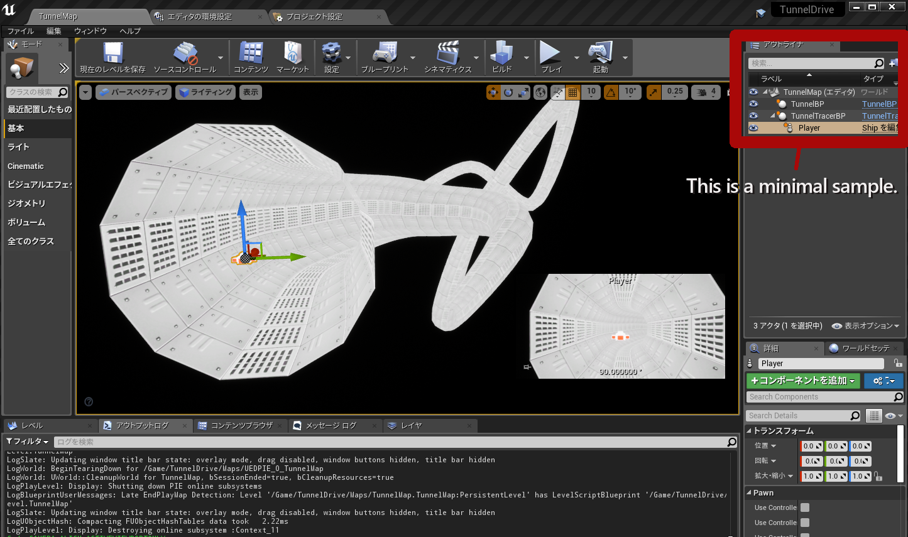
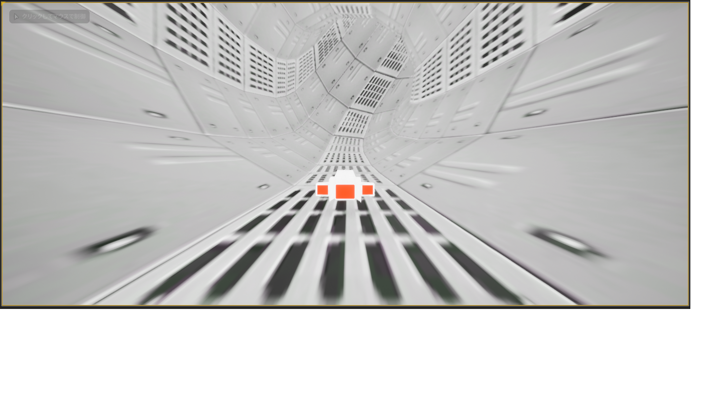

# TunnelDriveUE4
The base program for a simple tunnel game using UE4 2.23.1 (for Android sample). This is a sample for UE4 beginners.

---
## overview

This program is a minimal sample program for creating a tunnel game using the Unreal Engine (UE4).

---

## About the Android build

This program uses UE 4.23.1 to build for Android 4.4 or later. If you use UE 4.24 or later, you cannot build for Android 4.x because OpenGLES3.0 is not available.

---

## Bluepeine program

1. TunnelBP manages the mesh and splines of the tunnel, allowing you to edit the course of the tunnel in the UE editor.

1. TunnelTracerBP is an actor to move through the tunnel, referring to the splines of TunnelBP.

1. The PlayerBP is a spaceship. It accepts keystrokes and moves along the tunnel walls. It also holds a camera and the screen rotates as the keystrokes are entered.

Once you've learned this blue print, you can add obstacles, enemies, goal handling, title screen and more to create your own game!

---

### UE4 spline mesh training video
[Spline Live Training](https://www.youtube.com/watch?v=wR0fH6O9jD8)

[Spline Live Training in Japanese](https://www.youtube.com/watch?v=uwEwIyG_lpU "")

---

## my android tunnel game
[My Tunnel Game youtube video](https://youtu.be/8I1NBvGe4K8)

This is a tunnel game created using the same technique as this program and is available for download from Google Play. Note that this sample was created using Unity.

---

This text was created by unlock360. 
my home page : http://unlock360game.com/

---

Translated with www.DeepL.com/Translator (free version)
